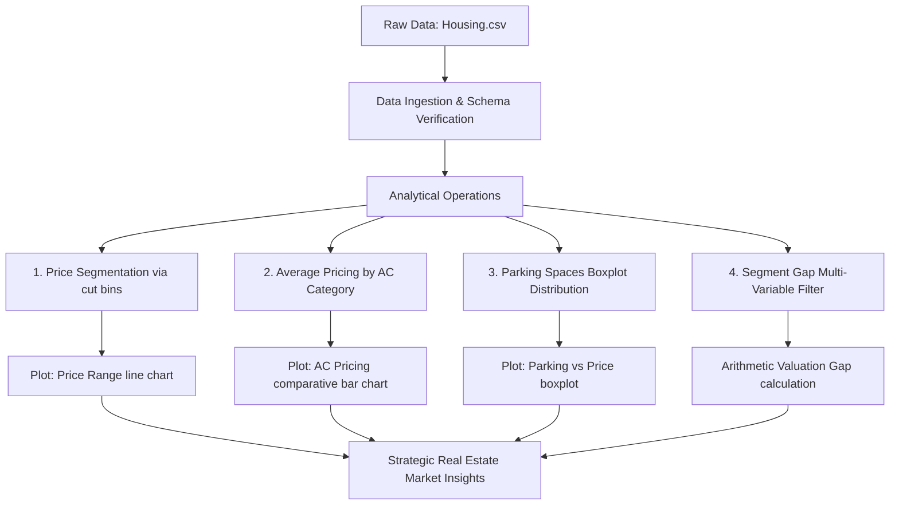

# 🏡 Real Estate Housing Valuation: Exploratory Data Analysis & Pricing Insights
An end-to-end exploratory data analysis (EDA) and analytical pipeline focused on identifying, quantifying, and visualizing the key factors driving property valuation. Using a dataset of 546 properties, this project models the statistical impact of capacity, physical footprint, utility additions, and location advantages on housing prices.

---

## 📋 Table of Contents
- [Project Overview](#-project-overview)
- [Dataset Schema & Definitions](#-dataset-schema--definitions)
- [Exploratory Analysis Pipeline](#-exploratory-analysis-pipeline)
- [Empirical Findings & Analysis Cases](#-empirical-findings--analysis-cases)
  - [1. Market Segmentation by Price Ranges](#1-market-segmentation-by-price-ranges)
  - [2. Utility Premium: The Value of Air Conditioning](#2-utility-premium-the-value-of-air-conditioning)
  - [3. Accommodation & Parking Valuation Dynamics](#3-accommodation--parking-valuation-dynamics)
  - [4. Valuation Gap: Standard vs. Premium Estates](#4-valuation-gap-standard-vs-premium-estates)
- [Technical Architecture](#-technical-architecture)
- [Getting Started & Installation](#-getting-started--installation)
- [Key Strategic Takeaways](#-key-strategic-takeaways)

---

## 🔍 Project Overview
This project delivers statistical and visual insights into real estate pricing mechanics. In accordance with the project guidelines specified in [Major Project - python.docx](file:///c:/Users/priya/OneDrive/Desktop/Skills/Elewayte/AI%20Minor%20Project/Major%20Project%20-%20python.docx), we address four core valuation questions through data aggregation, segmentation, and distribution plotting using Pandas, Matplotlib, and Seaborn.

> [!NOTE]  
> All codebase runs and visual output generation are performed interactively in [Minor.ipynb](file:///c:/Users/priya/OneDrive/Desktop/Skills/Elewayte/AI%20Minor%20Project/Minor.ipynb). The data is sourced directly from [Housing.csv](file:///c:/Users/priya/OneDrive/Desktop/Skills/Elewayte/AI%20Minor%20Project/Housing.csv).

---

## 📊 Dataset Schema & Definitions
The analysis relies on [Housing.csv](file:///c:/Users/priya/OneDrive/Desktop/Skills/Elewayte/AI%20Minor%20Project/Housing.csv), featuring **546 records** with **13 independent features** and one continuous target variable (`price`).

| Feature Name | Data Type | Feature Class | Definition & Units |
| :--- | :--- | :--- | :--- |
| **price** | Numeric | Target | Total market price of the property (in INR / absolute value) |
| **area** | Numeric | Physical | Build-up lot/floor area in square feet |
| **bedrooms** | Integer | Capacity | Total number of bedrooms (Range: 1–6) |
| **bathrooms** | Integer | Capacity | Total number of bathrooms (Range: 1–4) |
| **stories** | Integer | Physical | Number of property levels/floors (Range: 1–4) |
| **mainroad** | Categorical (Binary) | Location | Connected to the main road networks (`yes` / `no`) |
| **guestroom** | Categorical (Binary) | Capacity | Presence of a dedicated guestroom (`yes` / `no`) |
| **basement** | Categorical (Binary) | Physical | Presence of a basement floor (`yes` / `no`) |
| **hotwaterheating**| Categorical (Binary) | Utility | Presence of hot water heating facilities (`yes` / `no`) |
| **airconditioning**| Categorical (Binary) | Utility | Presence of air conditioning facilities (`yes` / `no`) |
| **parking** | Integer | Physical | Secure parking capacity in terms of car stalls (Range: 0–3) |
| **prefarea** | Categorical (Binary) | Location | Located in a preferred neighborhood/premium lot (`yes` / `no`) |
| **furnishingstatus**| Categorical (Ternary) | Aesthetic | Furnishing condition (`furnished`, `semi-furnished`, `unfurnished`) |

---

## ⚙️ Exploratory Analysis Pipeline
Below is a process mapping showing the ingestion, calculation, visualization, and strategic outputs:



---

## 📈 Empirical Findings & Analysis Cases

The core codebase is fully documented and structured as follows:

### 1. Market Segmentation by Price Ranges
Properties are classified into five customized price bins based on lakhs (1 Lakh = 100,000 INR) to identify volume distribution and market density:
*   **0–25 Lakhs (0-25L):** 32 Properties
*   **26–50 Lakhs (26-50L):** 318 Properties *(Market Majority - 58.2%)*
*   **51–75 Lakhs (51-75L):** 148 Properties
*   **76–100 Lakhs (76-100L):** 39 Properties
*   **Over 100 Lakhs (>100L):** 8 Properties *(Luxury Segment - 1.5%)*

#### Implementation Code Snippet:
```python
# Binning houses into ranges (INR scale)
bins = [0, 2500000, 5000000, 7500000, 10000000, float('inf')]
labels = ['0-25L', '26-50L', '51-75L', '76-100L', '>100L']
df['price_range'] = pd.cut(df['price'], bins=bins, labels=labels)
price_counts = df['price_range'].value_counts().reindex(labels)

# Line Chart Generation
plt.figure(figsize=(10, 5))
plt.plot(price_counts.index, price_counts.values, marker='o', linestyle='-', color='b')
plt.title('Number of Houses in Different Price Ranges')
plt.xlabel('Price Range')
plt.ylabel('Number of Houses')
plt.grid(True)
plt.show()
```

> [!TIP]
> **Market Insight:** Developers looking for maximum velocity should focus on the 26-50L price tier, as it captures the bulk of active homebuyer demand.

---

### 2. Utility Premium: The Value of Air Conditioning
We computed the baseline pricing premium associated with air conditioning systems:
*   **Non-Air Conditioned (Non-AC) Mean Price:** 4.19 Million (4,191,940 INR)
*   **Air Conditioned (AC) Mean Price:** 6.01 Million (6,013,221 INR)
*   **Absolute Price Premium:** **1,821,281 INR (~43.4% increase)**

#### Implementation Code Snippet:
```python
avg_price_ac = df.groupby('airconditioning')['price'].mean()

# Bar Chart Representation
plt.figure(figsize=(8, 5))
sns.barplot(x=avg_price_ac.index, y=avg_price_ac.values, palette='viridis')
plt.title('Average House Price: AC vs Non-AC')
plt.xlabel('Air Conditioning')
plt.ylabel('Average Price (Millions)')
plt.show()
```

---

### 3. Accommodation & Parking Valuation Dynamics
The relationship between available car slots and price distribution highlights how parking capacity influences asset valuation. Boxplots reveal that both median price and overall pricing variance scale up with each additional stall.

#### Implementation Code Snippet:
```python
# Simulating pricing distributions across parking capacity levels
plt.figure(figsize=(8, 5))
sns.boxplot(x='parking', y='price', data=df)
plt.title('Relationship between Parking Spaces and House Price')
plt.xlabel('Number of Parking Spaces')
plt.ylabel('Price')
plt.show()
```

---

### 4. Valuation Gap: Standard vs. Premium Estates
A multi-variable segment gap analysis compared basic properties against high-end properties based on the following criteria:

$$\text{Group A (Standard): } \text{Area} < 5,000 \text{ sqft } \wedge \text{ Preferred Area} = \text{'no'}$$
$$\text{Group B (Premium): } \text{Area} > 5,000 \text{ sqft } \wedge \text{ Preferred Area} = \text{'yes'}$$

*   **Group A Average Price:** **3,827,671.56 INR**
*   **Group B Average Price:** **6,546,807.69 INR**
*   **Empirical Price Gap:** **2,719,136.13 INR** *(An increase of ~71.04%)*

#### Implementation Code Snippet:
```python
# Group A filters
group_a = df[(df['area'] < 5000) & (df['prefarea'] == 'no')]
avg_a = group_a['price'].mean()

# Group B filters
group_b = df[(df['area'] > 5000) & (df['prefarea'] == 'yes')]
avg_b = group_b['price'].mean()

# Premium Gap computation
price_gap = avg_b - avg_a
```

---

## 📁 Technical Architecture
The repository is laid out in a flat structure suitable for notebook-based execution:

```
AI Minor Project/
│
├── Housing.csv                  # The source real estate dataset (546 records)
├── Minor.ipynb                  # Fully executed Jupyter Notebook containing EDA and plots
├── README.md                    # Project documentation (this file)
└── Major Project - python.docx  # Project assignment specification and parameters
```

### Technology & Libraries
*   **Runtime:** Python 3.8+ (Tested on Python 3.13)
*   **Data Aggregation:** Pandas
*   **Plotting Engine:** Matplotlib
*   **Aesthetic Styling:** Seaborn

---

## 🚀 Getting Started & Installation

### 1. Configure the Virtual Environment
Create a clean directory and initialize a virtual environment:
```bash
# Clone or navigate to the workspace
cd "AI Minor Project"

# Create a local virtual environment
python -m venv venv

# Activate the virtual environment (Windows Command Prompt/PowerShell)
.\venv\Scripts\activate
```

### 2. Install Required Dependencies
Install the required analytical and notebook execution tools:
```bash
pip install pandas matplotlib seaborn notebook
```

### 3. Launch the Analytical Notebook
Fire up the local Jupyter server to run the cells:
```bash
jupyter notebook Minor.ipynb
```

---

## 💡 Key Strategic Takeaways
1.  **Air Conditioning Premium:** Adding AC units is statistically the most capital-efficient utility enhancement, correlating with an average property value lift of **43.4%**.
2.  **Location & Space Compounding Effect:** Home buyers pay a massive premium of **~71%** (2.71 Million INR) for properties that compound lot footprint (>5000 sqft) with prime location settings (`prefarea = yes`).
3.  **Parking Diminishing Returns:** Property value scales linearly from 0 to 2 parking spaces; however, properties with 3 stalls show high price volatility, reflecting luxury outliers rather than a purely linear valuation model.
